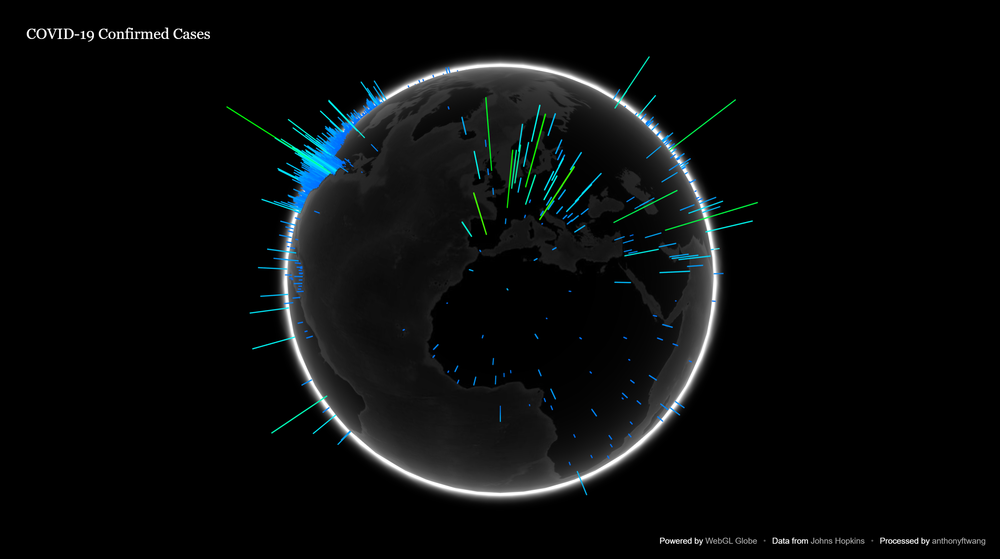

# webgl-globe-covid19
Visualize global confirmed cases of COVID-19. Updated daily at [earth.fightingcovid.net](earth.fightingcovid.net).

### Usage:

Clone the repository and run `./getupdates.sh` to pull the latest data from the Johns Hopkins CSSE repo. Data processing occurs automatically. Currently, the scripts `process_confirmed.py` and `process_deaths.py` use a root function to compress values for each region. Experiment with logarithmic techniques or others to try and achieve the best balance between accuracy and viewability.

Change the JSON source and title in `index.html` to see deaths instead of cases. You can view the globe locally by running `python -m http.server` from the project directory and opening `localhost:8000`.